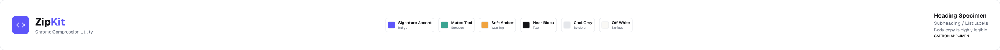
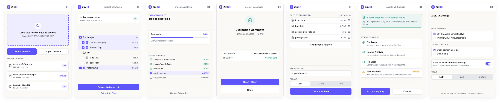

# ZipKit

<div align="center">



**Zip. Unzip. Pack. Unpack. Inspect. Scan.**

A modern Chrome extension for creating, inspecting, and extracting archive files with built-in security scanning.

[](https://github.com/eyuelabebe/zipkit/actions)
[](LICENSE)
[](https://www.typescriptlang.org/)
[](https://developer.chrome.com/docs/extensions/mv3/)
[](CONTRIBUTING.md)

[Features](#features) • [Screenshots](#screenshots) • [Installation](#installation) • [Documentation](docs/) • [Contributing](CONTRIBUTING.md)

</div>

---

## ⚠️ Project Status

**ZipKit is currently in active development.**

Core functionality is implemented and the extension is ready for testing. Security scanning features are operational but should not be considered production-ready.

**Use at your own risk. This extension is not yet fully tested for production use.**

---

## Features

### 🎯 Core Capabilities

<table>
<tr>
<td width="50%">

#### Archive Creation

- ✅ ZIP, TAR, TAR.GZ formats
- ✅ Drag & drop file selection
- ✅ Folder selection with subdirectories
- ✅ Hierarchical folder structure display
- ✅ Multiple compression levels
- ✅ Real-time progress tracking

</td>
<td width="50%">

#### Archive Extraction

- ✅ Safe extraction with validation
- ✅ Browse contents before extracting
- ✅ Selective file extraction
- ✅ Destination folder selection
- ✅ File tree preview
- ✅ Progress monitoring

</td>
</tr>
<tr>
<td width="50%">

#### Security Scanning

- ✅ Real-time security analysis
- ✅ Path traversal detection
- ✅ Archive bomb detection
- ✅ Executable file detection
- ✅ Nested archive detection
- ✅ Integrity verification

</td>
<td width="50%">

#### User Experience

- ✅ Dark modern UI theme
- ✅ Modal-based workflow
- ✅ Recent archives history
- ✅ Drag & drop support
- ✅ Local-first (no cloud uploads)
- ✅ Cross-platform compatibility

</td>
</tr>
</table>

### 🔜 Planned Features

- RAR, 7z support
- Password-protected archives
- Chrome download integration
- Advanced security signatures

---

## Screenshots

<div align="center">

### Home & Archive Creation



### Extraction & Security Scanning


</div>

---

## Installation

### For Users

**Chrome Web Store** _(Coming Soon)_

### For Developers

```bash
# Clone and install
git clone https://github.com/eyuelabebe/zipkit.git
cd zipkit
npm install

# Build extension
npm run build

# Load in Chrome
# 1. Open chrome://extensions/
# 2. Enable "Developer mode"
# 3. Click "Load unpacked"
# 4. Select apps/extension/dist
```

**Quick Commands:**

```bash
make dev          # Install and build
make load         # Build and show load instructions
make upload       # Package and show upload instructions
```

See [Development Setup Guide](docs/development/development-setup.md) for detailed instructions.

---

## Quick Start

### Creating an Archive

1. Click the ZipKit icon in your browser toolbar
2. Click **"Create Archive"** or drag & drop files
3. Select files or choose a folder (includes subdirectories)
4. Choose format (ZIP, TAR, TAR.GZ)
5. Click **"Create Archive"** and save

### Extracting an Archive

1. Click the ZipKit icon
2. Drag & drop an archive or click **"Open Archive"**
3. Wait for security scan to complete
4. Review file contents in the tree view
5. Choose extraction destination
6. Click **"Extract All Files"** or select specific files

---

## Technology Stack

- **Language:** TypeScript 5.0+ (strict mode)
- **Runtime:** Chrome Browser (Manifest V3)
- **UI Framework:** Custom components with Web Standards
- **Archive Processing:** Streaming architecture for large files
- **Testing:** Playwright E2E, Unit tests
- **Build:** esbuild, npm workspaces
- **CI/CD:** GitHub Actions

**Key Architecture Principles:**

- 🔒 **Local-first** - No remote servers
- ⚡ **Web Workers** - CPU-intensive operations off main thread
- 📦 **Monorepo** - Organized packages (`archive-core`, `archive-security`, `ui`, `extension`)
- 🔐 **Minimal permissions** - Storage only

---

## Documentation

| Category                | Link                                                       |
| ----------------------- | ---------------------------------------------------------- |
| 📚 **Getting Started**  | [Development Setup](docs/development/development-setup.md) |
| 🏗️ **Architecture**     | [Architecture Overview](docs/architecture/)                |
| 🔐 **Security Model**   | [Security Documentation](docs/security/)                   |
| 🧪 **Testing**          | [Testing Guide](docs/testing/)                             |
| 🚀 **Release Process**  | [Release Documentation](docs/release/)                     |
| 📋 **Contributing**     | [CONTRIBUTING.md](CONTRIBUTING.md)                         |
| 🔒 **Security Policy**  | [SECURITY.md](SECURITY.md)                                 |
| 💡 **Decisions (ADRs)** | [Architecture Decisions](docs/decisions/)                  |

---

## Contributing

We welcome contributions! ZipKit follows **issue-driven development** - all significant work starts with a GitHub issue.

### Quick Contribution Guide

1. 🔍 Find or create a GitHub issue
2. 🌿 Create feature branch: `feature/<issue>-<description>`
3. 💻 Make focused changes with tests
4. ✅ Run quality checks: `npm run format && npm run lint && npm run test`
5. 📝 Commit using [Conventional Commits](https://www.conventionalcommits.org/)
6. 🚀 Open a Pull Request

**Important:**

- Never commit directly to `main`
- Keep changes small and focused
- Add tests for behavioral changes
- Update docs when behavior changes

Read [CONTRIBUTING.md](CONTRIBUTING.md) for complete guidelines.

---

## Security & Privacy

### 🔒 Security Model

ZipKit performs **real-time structural archive safety analysis**:

- ✅ Path traversal detection
- ✅ Archive bomb detection (expansion ratios)
- ✅ Executable and script detection
- ✅ Nested archive detection
- ✅ Integrity verification

**⚠️ Important:** ZipKit is NOT antivirus software. It detects structural anomalies but cannot guarantee malware detection. Use alongside your existing security tools.

### 🔐 Privacy

**ZipKit is 100% local-first:**

- ✅ All processing happens in your browser
- ✅ No remote servers or cloud uploads
- ✅ No tracking or analytics
- ✅ No data collection
- ✅ Your archives stay private

### 🐛 Reporting Vulnerabilities

**Do not report security vulnerabilities in public issues.**

Email security reports to: [security contact in SECURITY.md]

See [SECURITY.md](SECURITY.md) for responsible disclosure process.

---

## Support

- 📖 [Documentation](docs/)
- 🐛 [Report Bug](https://github.com/eyuelabebe/zipkit/issues/new?labels=bug)
- 💡 [Request Feature](https://github.com/eyuelabebe/zipkit/issues/new?labels=enhancement)
- 💬 [Discussions](https://github.com/eyuelabebe/zipkit/discussions)

---

## License

MIT License - see [LICENSE](LICENSE)

Copyright (c) 2024 ZipKit Contributors

---

<div align="center">

**Built with modern web standards • Focused on privacy and security • 100% local-first**

[⭐ Star us on GitHub](https://github.com/eyuelabebe/zipkit) • [🐛 Report Issues](https://github.com/eyuelabebe/zipkit/issues) • [📖 Read Docs](docs/)

</div>
